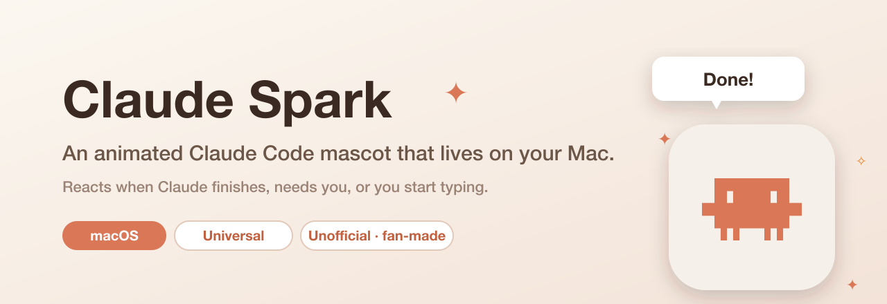
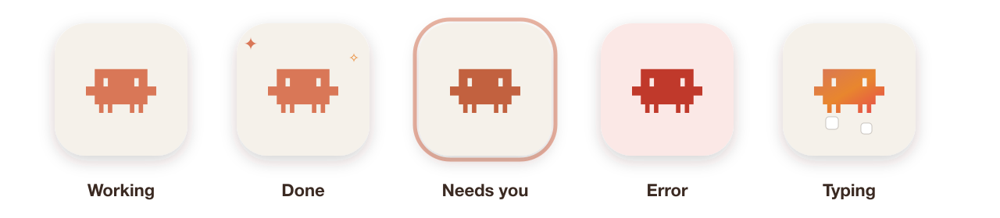
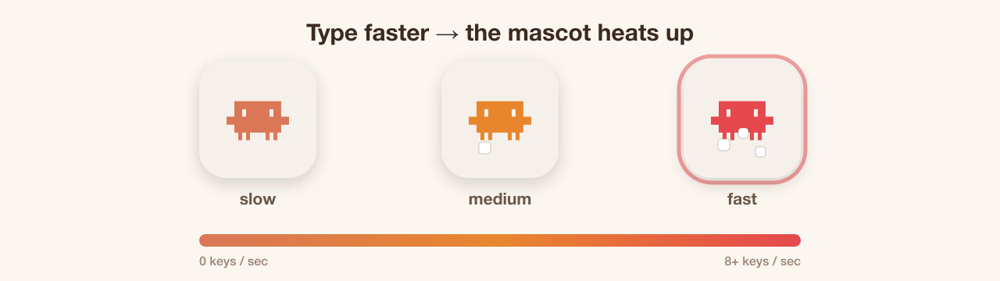
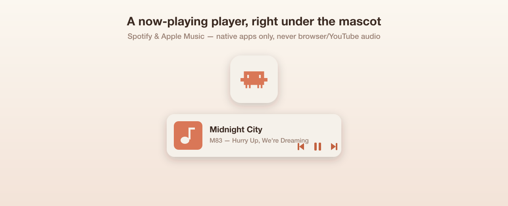
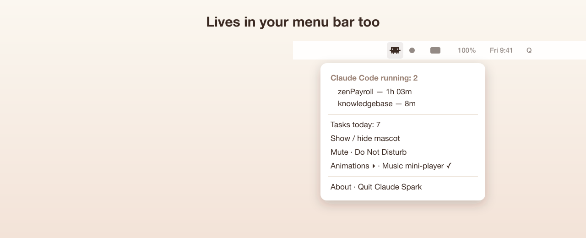
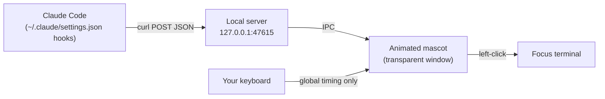

<p align="center">
  
</p>

<h1 align="center">Claude Spark&nbsp;✦</h1>

<p align="center">
  <strong>An animated desktop mascot for the Claude&nbsp;Code CLI (command-line interface).</strong><br>
  It floats in the corner of your Mac and reacts when Claude finishes, needs you, or you start typing — and heats up the faster you type.
</p>

<p align="center">
  <sub>🖥️ Built for <a href="https://docs.claude.com/en/docs/claude-code">Claude&nbsp;Code</a> — Anthropic's <strong>command-line</strong> coding agent that runs in your terminal. Claude Spark is a companion <em>for</em> the CLI; it isn't a GUI or browser extension.</sub>
</p>

<p align="center">
  <a href="https://github.com/jeremyperson/claude-spark/releases/latest"></a>
  
  
  
  <a href="LICENSE"></a>
  
</p>

<p align="center">
  <a href="https://github.com/jeremyperson/claude-spark/releases/download/claude-spark-v1.2.0/Claude.Spark-1.2.0-universal.dmg">
    
  </a>
</p>

---

## What is Claude Spark?

[**Claude&nbsp;Code**](https://docs.claude.com/en/docs/claude-code) is Anthropic's **command-line interface (CLI)** for Claude — an AI coding agent you run in your terminal. It does its work in the terminal, but your eyes aren't always on it. **Claude Spark** is a tiny, charming desktop companion that gives the Claude&nbsp;Code CLI an ambient, at-a-glance presence on your Mac.

It's a transparent, always-on-top, click-through window showing the Claude&nbsp;Code mark on a soft cream card. It bobs and blinks while idle, then **animates in response to what Claude&nbsp;Code is actually doing** — driven by Claude&nbsp;Code's [hook system](https://docs.claude.com/en/docs/claude-code/hooks). No more wondering whether that long task finished or whether Claude is quietly waiting for your approval.

> Think of it as a Tamagotchi for your AI pair-programmer. 🐣

---

## Reactions

Claude Spark listens for Claude&nbsp;Code events and reacts with a distinct animation, a speech bubble, and an optional sound:

<p align="center">
  
</p>

| When… | Hook | The mascot… |
|---|---|---|
| You send a prompt | `UserPromptSubmit` | pulses & tilts — *"On it…"* |
| It runs long (>2 min) | *(derived)* | shifts to a slower *"Still working…"* grind |
| A subagent finishes | `SubagentStop` | *off by default — an internal step, not something you act on; enable in `config.json`* |
| **Claude needs you** | `Notification` | bounces with a glow + chime, and **escalates** until you respond — *"project · Needs your OK 👀"* |
| **Claude finishes** | `Stop` | spins with sparkles + chime — *"project · done in 2m14s"* |
| A turn fails | `StopFailure` | red shake — *"project · Something broke ⚠️"* |
| A tool runs | `PreToolUse` | subtle micro-pulse *(off by default)* |

Every reaction names **which Claude Code thread** it came from — the project folder shows in the bubble and is the title of the macOS notification — so when you're running several sessions you know exactly which one finished or needs you. (Reactions also fire a native notification unless muted, so you catch them when looking away.)

---

## ⌨️ Type-speed reactions

Claude Spark watches your **typing cadence** and changes color with your speed — coral when you're cruising, glowing red when you're on fire — bouncing and puffing little keycaps as you go.

<p align="center">
  
</p>

> **Privacy first:** this measures keystroke **timing only** — it never reads, stores, or transmits *which* keys you press. The code ignores the keycode entirely. It requires macOS **Accessibility** permission (the app asks on first launch).

---

## 🎵 Now-playing mini-player

When you're playing music in a **native** app — **Spotify** or **Apple Music** — a compact
player tucks in right beneath the mascot: album art, title, artist, and **play / pause / next /
previous** controls. It's wired through each app's AppleScript, so it covers those desktop apps
only and **ignores browser/YouTube audio** by design.

<p align="center">
  
</p>

> Reading and controlling another app needs a one-time macOS **Automation** permission
> ("Claude Spark wants to control Spotify"). Toggle the whole feature from the menu or
> `config.json` (`musicPlayer`).

## 🖥️ Lives in your menu bar

Claude Spark also adds a **menu-bar icon** (top-right of your screen) with the full menu —
running Claude Code instances and their uptime, Tasks today, Animations, hooks, the music
toggle, and **Show / Hide mascot** so you can tuck the floating window away while keeping the
menu-bar presence.

<p align="center">
  
</p>

## Install

1. **[⬇ Download the latest `.dmg`](https://github.com/jeremyperson/claude-spark/releases/latest)** and open it.
2. Drag **Claude Spark** into **Applications**.
3. First launch: the build is unsigned, so macOS Gatekeeper will warn — **right-click the app → Open → Open** (once).
4. Claude Spark offers to install its Claude&nbsp;Code hooks into `~/.claude/settings.json`. Click **Install hooks**, then restart any open Claude&nbsp;Code sessions.
5. *(Optional)* grant **Accessibility** permission when prompted to enable type-speed reactions.

That's it — the spark now lives in your bottom-right corner. 🎉

---

## Interactions

- **Left-click** → focuses the terminal that needs you (raises the app the session runs in).
- **Drag** → move it anywhere; its position is remembered.
- **Right-click** → a full menu:
  - **Running Claude&nbsp;Code instances + per-instance uptime** (`project — 1h 03m`)
  - **Animations ▸** — *Random* (subtle idle flourishes) / *Calm*, plus **Play ▸** to trigger any animation on demand
  - **Mute**, **Do Not Disturb**, **Reset position**, **Open at login**
  - **Install / Remove hooks**, **Retry typing access**, **Open config.json**
  - **About Claude Spark** (the disclaimer below)

---

## How it works

Claude&nbsp;Code hooks `curl` each event's JSON to a tiny HTTP server inside the app, which relays it to the animated window over IPC. Hooks use `curl -s --max-time 1`, so if Spark isn't running they fail instantly and **never block or slow down Claude&nbsp;Code**.



Bonus: `curl http://127.0.0.1:47615/sessions` returns running Claude&nbsp;Code instances and their uptime as JSON.

---

## Configuration

Settings live in `config.json` (in the app's data folder — right-click → **Open config.json**). Restart after editing; missing keys fall back to sensible defaults.

| Key | What it does |
|---|---|
| `corner` | Starting corner: `bottom-right` (default), `bottom-left`, `top-right`, `top-left` |
| `enabledEvents` | Per-event on/off switches |
| `sounds` | `enabled` + per-state sound files (defaults to macOS system sounds) |
| `bubbleDurationMs` | How long the speech bubble stays up |
| `nudge` | `{enabled, afterMs, repeatMs, maxRepeats}` — escalating reminder when Claude needs you |
| `longRunAfterMs` | When a running task flips to the "still working" state (default 120000) |
| `toolReactions` | Per-tool micro-reactions from `PreToolUse` (default `false`) |
| `showOnlyDuringSessions` | `{enabled, idleFadeMs}` — fade out when no session is active |
| `keyboard` | `{enabled, scheme}` — type-speed reactions; scheme is `heat`, `cool`, or `rainbow` |

---

## Build from source

```bash
git clone https://github.com/jeremyperson/claude-spark.git
cd claude-spark
npm install
npm start            # run in dev
npm run dist         # build a universal .dmg + .zip into release/ (also copies the .dmg here)
```

Requires Node, plus `rsvg-convert` (`brew install librsvg`) to regenerate the icon. Built with [Electron](https://www.electronjs.org/) + [electron-builder](https://www.electron.build/); global key timing via [`uiohook-napi`](https://github.com/SnosMe/uiohook-napi).

### Signing & notarization

Unsigned builds need the one-time *right-click → Open*. To distribute without the Gatekeeper warning, sign + notarize with an Apple Developer ID — the pipeline is wired and ready (`npm run dist:signed`). Full runbook: **[SIGNING.md](SIGNING.md)**.

---

## ⚖️ Disclaimer

Claude Spark is an **unofficial, fan-made** project. It is **not affiliated with, endorsed by, sponsored by, or supported by Anthropic, PBC.** "Claude", "Claude&nbsp;Code", and related names and logos are trademarks of Anthropic, PBC, used here for identification/descriptive purposes only. All trademarks are the property of their respective owners. Provided **as-is, without warranty**.

## License

[MIT](LICENSE) © 2026 Jeremy Person
